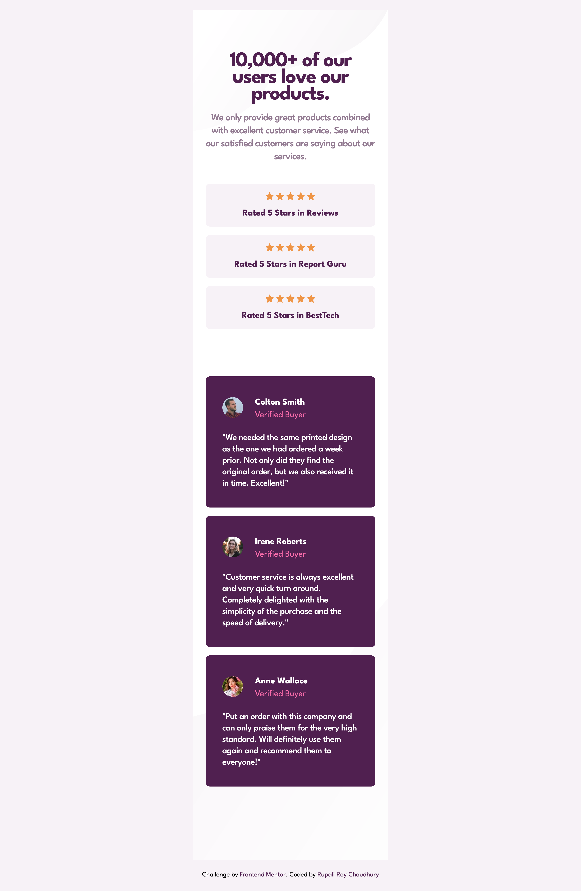

# Frontend Mentor - Social proof section solution

This is a solution to the [Social proof section challenge on Frontend Mentor](https://www.frontendmentor.io/challenges/social-proof-section-6e0qTv_bA). Frontend Mentor challenges help you improve your coding skills by building realistic projects. 

## Table of contents

- [Overview](#overview)
  - [The challenge](#the-challenge)
  - [Screenshots](#screenshot)
  - [PageSpeed Insights results](#pagespeed-insights-results)
  - [Links](#links)
- [My process](#my-process)
  - [Built with](#built-with)
  - [Tested with](#tested-with)
  - [What I learned](#what-i-learned)
  - [Continued development](#continued-development)
  - [Useful resources](#useful-resources)
- [Author](#author)
- [Acknowledgments](#acknowledgments)

## Overview

### The challenge

Users should be able to:

- View the optimal layout for the section depending on their device's screen size

### Screenshots




### PageSpeed Insights results

[Mobile version](https://pagespeed.web.dev/analysis/https-social-proof-section-master-rc-netlify-app/xldzag2tuw?form_factor=mobile)


[Desktop version](https://pagespeed.web.dev/analysis/https-social-proof-section-master-rc-netlify-app/xldzag2tuw?form_factor=desktop)


### Links

- Solution URL: [Social proof section master github](https://github.com/rupali317/social-proof-section-master)
- Live Site URL: [Social proof section master challenge live](https://social-proof-section-master-rc.netlify.app/)

## My process

### Built with

- Semantic HTML5 markup
- CSS custom properties
- Flexbox
- CSS Grid
- Mobile-first workflow
- [React](https://reactjs.org/) - JS library
- [Styled Components](https://styled-components.com/) - For styles

### Tested with

- Browsers used for testing: Google Chrome, Firefox, Safari, Brave, Microsoft Edge
- Devices: 
  - (Real) MacBook Pro (15 inch), Samsung Galaxy A33 5G, Samsung Galaxy S20+
  - (Virtual) The mobile and tablet devices mentioned under Chrome's dev console

### What I learned

Use this section to recap over some of your major learnings while working through this project. Writing these out and providing code samples of areas you want to highlight is a great way to reinforce your own knowledge.

To see how you can add code snippets, see below:

```html
<h1>Some HTML code I'm proud of</h1>
```

### Continued development

Use this section to outline areas that you want to continue focusing on in future projects. These could be concepts you're still not completely comfortable with or techniques you found useful that you want to refine and perfect.


### Useful resources

- [Learn CSS Grid the easy way](https://www.youtube.com/watch?v=rg7Fvvl3taU&ab_channel=KevinPowell) - Provides the demo of CSS grids basics. A good refresher.
- [A guide to learning CSS grid](https://learncssgrid.com/) - Provides a clear documentation of the Grid functionalities.
- [Accessibility Insights for Web](https://chromewebstore.google.com/detail/accessibility-insights-fo/pbjjkligggfmakdaogkfomddhfmpjeni) - This Google chrome extension is handy since it provides accessibility tests such as the color contrast, bypass mechansim, focus order, keyboard navigation, no missing headers, headling level, link purpose.

## Author

- Website - [Rupali Roy Choudhury](https://www.linkedin.com/in/rupali-rc/)
- Frontend Mentor - [@rupali317](https://www.frontendmentor.io/profile/rupali317)

## Acknowledgments

- I express my gratitude towards my mentor - Deborah for the insightful code review session.